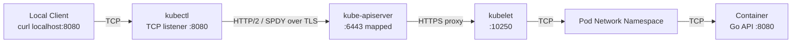

# Service and Port Forwarding Notes

## Context

After deploying the application using a Kubernetes `Deployment`, the next step was to expose the application **inside the cluster** and verify that traffic could correctly reach the Pods.

At this stage:

* There is **no Ingress**
* The Service type is **ClusterIP**
* Traffic is verified using **`kubectl port-forward`**

This document records what I learned about **why Services are required** and **how port-forwarding actually works**.

---

## 1. Why a Service Is Needed in Addition to a Deployment

A `Deployment` is responsible for:

* Running Pods
* Maintaining replica count
* Restarting failed Pods

However, a Deployment **does not provide a stable network endpoint**.

### Pod IPs Are Ephemeral

* Each Pod receives its own IP
* Pod IPs change when:

  * Pods restart
  * Pods are rescheduled
  * Rolling updates occur

Directly connecting to Pods is therefore unreliable.

---

## 2. What a Service Provides

A Kubernetes `Service` introduces a **stable network abstraction**.

```yaml
kind: Service
spec:
  type: ClusterIP
```

Key properties:

* Assigns a **stable virtual IP (ClusterIP)**
* Automatically load-balances traffic to healthy Pods
* Tracks Pod health via readiness probes
* Selects Pods using labels

The Service becomes the **single, stable entry point** for a group of Pods.

---

## 3. Understanding ClusterIP

A `ClusterIP` is:

* A virtual IP address
* Only reachable **inside the Kubernetes cluster**
* Not routable from the host machine or external networks

Example:

```bash
kubectl get svc
```

```
NAME            TYPE        CLUSTER-IP      PORT(S)
url-shortener   ClusterIP   10.96.123.45    80/TCP
```

The IP `10.96.123.45`:

* Exists only within the cluster network
* Always points to the current set of healthy Pods

---

## 4. Why ClusterIP Is Not Directly Accessible from My Laptop

My laptop is **outside the Kubernetes cluster network**.

Therefore:

```bash
curl http://10.96.123.45
```

does not work from the host.

This separation is intentional and enforces a clear boundary between:

* Cluster-internal networking
* External access mechanisms (Ingress, NodePort, LoadBalancer)

---

## 5. Purpose of `kubectl port-forward`

`kubectl port-forward` is a **debugging and verification tool**, not a production access method.

It temporarily creates a tunnel from the local machine into the cluster.

```bash
kubectl port-forward svc/url-shortener 8080:80
```

This command:

* Opens a local TCP listener on `localhost:8080`
* Forwards traffic to the Service’s ClusterIP on port 80
* Allows verification without exposing the Service externally

---

## 6. Port-Forwarding Through a Service vs a Pod

### Port-forwarding a Service

```bash
kubectl port-forward svc/url-shortener 8080:80
```

Traffic path:

```
localhost → Service → Pod → Container
```

This validates:

* Service selectors
* Port and targetPort configuration
* Readiness-based traffic routing

---

### Port-forwarding a Pod

```bash
kubectl port-forward pod/<pod-name> 8080:8080
```

Traffic path:

```
localhost → Pod → Container
```

This bypasses:

* The Service
* Load balancing
* Readiness logic

It is useful for low-level debugging but does not validate the real application path.

---

## 7. How Port-Forwarding Works Internally (High-Level)

When port-forwarding a Service:

1. `kubectl` opens a local TCP port
2. Traffic is tunneled through the Kubernetes API Server
3. The API Server proxies the connection to the correct node
4. The node’s kubelet connects to the Pod
5. Raw TCP bytes are forwarded to the container

This uses the Kubernetes **control plane**, not the data plane.

---

## 8. Why Port-Forwarding Is Used Before Ingress

Ingress introduces additional complexity:

* Ingress controller
* Host/path routing
* Port 80/443 mapping
* DNS / Host headers

By using port-forwarding first, I can verify:

* Pods are healthy
* Services route traffic correctly
* Ports and selectors are correct

Ingress is added **only after** this base path is confirmed to work.

---

## 9. Architecture Diagram


---

## 10. Rolling Update Behavior When Readiness Fails

During the port-forwarding experiment, I intentionally broke the `readinessProbe` by patching the Deployment.
This triggered an important Kubernetes behavior that is central to zero-downtime deployments.

### What Happened

After patching the Deployment:

* A **new Pod** was created using the updated Pod template
* The new Pod stayed in `Running` state but remained `NotReady`
* The **existing Pods were not terminated**

Example state:

```text
Old Pod A   READY 1/1   Running
Old Pod B   READY 1/1   Running
New Pod C   READY 0/1   Running
```

This resulted in more Pods than the desired replica count for a short period of time.

---

### Why Old Pods Were Not Deleted

Kubernetes Deployments use a **rolling update strategy** by default.

The key rule is:

> **Old Pods are not terminated until new Pods become Ready.**

This ensures that:

* Traffic is never dropped during updates
* Service availability is preserved even if the new version is broken

In this experiment, because the new Pod failed its readiness check:

* Kubernetes paused the rollout
* Old Pods continued serving traffic
* The Service endpoints only included the Ready Pods

---

### Interaction with Services and Readiness

This behavior works together with Services and readiness probes:

* **Readiness probes** control whether a Pod receives traffic
* **Services** only route traffic to Ready Pods
* **Deployments** refuse to scale down old Pods until replacements are Ready

As a result:

* The Service never routed traffic to the broken Pod
* Users experienced no downtime
* The rollout safely stalled instead of causing an outage

---

### Key Insight

> A failed readiness check does not crash the application, but it prevents Kubernetes from trusting it with traffic.

This experiment demonstrates that Kubernetes prioritizes **availability over progress** during rolling updates.

---

## 11. Key Takeaways

* Deployments manage Pods, not networking
* Services provide stable, load-balanced access to Pods
* ClusterIP is internal-only by design
* Port-forwarding bridges the host and cluster temporarily
* Port-forwarding a Service validates the same path Ingress will use
* Services route traffic only to Ready Pods
* Readiness probes gate traffic, not process lifecycle
* Rolling updates will not remove old Pods until new ones are Ready
* Zero-downtime is achieved through conservative rollout behavior

---

## Next Steps

* Install an Ingress controller
* Expose the Service via Ingress
* Replace port-forwarding with real HTTP entry points